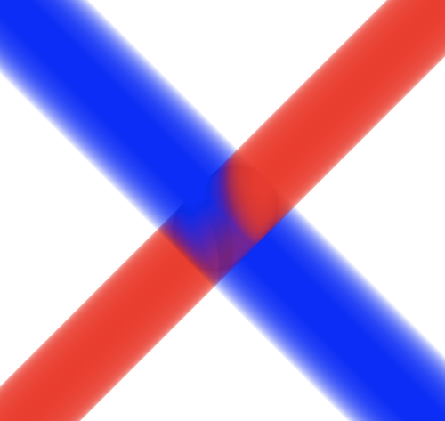

# Exercise 1 - Moving Pictures

__Grade__: 1.25% of final grade (see guidelines at bottom)  
__Deadline__: 11:59PM on the day of class on week of 16 September 2019.

## Brief

Add to the wonderful world of moving shapes with your own ideas, including at least one image!

## Learning objectives

- Get comfortable adding code to an existing script
- Adding comments when you add/change code
- Using Git, GitHub Desktop, and GitHub to track and submit your code

## Steps

This is the only time we will present the steps for an exercise in so much detail, just to give you the idea of a good workflow that will be easy for us to grade and will meet the requirements. It will help you remember to do things like: comment your code, proceed in sensible steps and commit your work as you go, use good commit messages that include the name of the exercise you're working on at the start for clarity.

1. __Download__ the exercise starter and unzip it: [exercise1.zip](exercise1.zip)
2. __Move__ the exercise project folder called `exercise1` into the `cart253-2018/exercises/` folder of your local copy of your class repository
3. __Commit__ this work in GitHub Desktop with a descriptive message like "Ex1: Added starter code project"
4. __Push__ your commit, just to be safe
5. __Open__ the starter code project folder in Atom, __read__ the script all the way through, __run__ it with atom-live-server to observe its behavior
6. __Add an image or shape__ to the code that starts off the left side of the canvas and moves from left to right across the canvas when the program runs.
7. __Comment__ your added code with explanatory comments
8. __Commit__ this work in GitHub Desktop with a descriptive message like "Ex1: Added shape moving left to right"
8. __Push__ your commit
9. __Add an image__ that is always displayed at the current mouse location.
10. __Comment__ your added code with explanatory comments
11. __Commit__ this work in GitHub Desktop with a descriptive message like "Ex1: Added image under that follows the mouse"
12. __Push__ your commit
13. __Add one more image or shape__ that moves in a different way to the others (just direction is fine, but you can challenge yourself).
14. __Comment__ your added code with explanatory comments
15. __Commit__ this work in GitHub Desktop with a descriptive message, prefixed with "Ex1"
16. __Push__ your commit

(Optional challenge: add an image that moves across the screen according to a sine wave.)

## Starter Code

[exercise1.zip](exercise1.zip)

## Submission

You will submit this exercise as a __comment__ on an __Issue__ on the course repository here:

https://github.com/pippinbarr/cart253-2019/issues

(Click on the Issue with the name of the exercise and your section letter and follow the instructions. Note that we don't know about GitHub Pages yet - we will look at it next week, but you're welcome to investigate it yourself before then if you wish.)

## Grading

Grading for exercises is pass/fail. Passing requires __all__ of the following to be satisfactory:

- __Runs__ and __implements the challenges required__
- Has __suitable commenting for all added/changed code__
- Includes a minimum of __one initial commit of the template code__, and __one commit message per substantive change (such as completing one element)__, all commits must have a __descriptive message__
- Uses __good naming__ for added variables
- Is __well structured__, with new code added in sensible places in sensible orders
